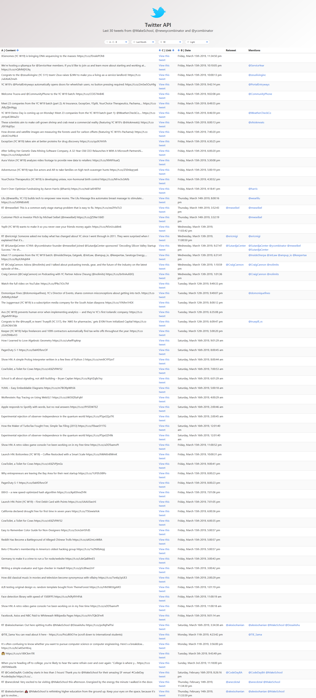

#  Frontend Code Challenge

## Setup

Install the project dependencies:

`yarn install`

## Running

Update config.json with your Twitter API credentials.
Start the static and proxy servers:

`yarn start`

This server will help you to get Twitter's API to send you tweets without you needing to do any authentication.  You don't need to modify server.js at all. 

`yarn dev`

Run the frontend web application. 

`yarn test`

Run unit tests. 
